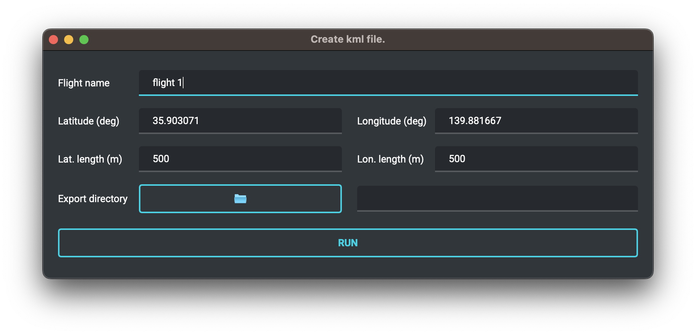
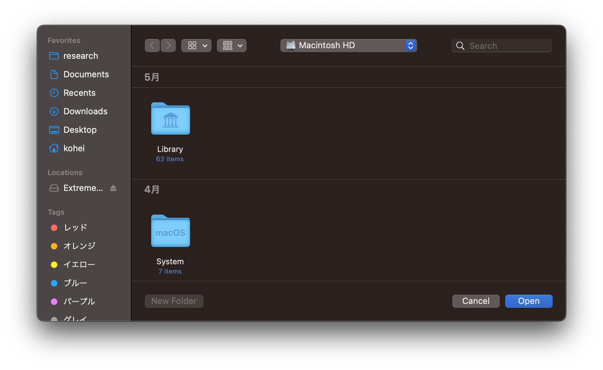

# kml_exporter
## Discription
This script provides GUI application that export kml file to be imported with DJI GS Pro.


## Usage
1. Download zip file from latest release of this repository and unzip on arbitrary direcotry.
2. Run executable file corresponding to local OS, then GUI application will start up.



3. Set variables.

| Variables | Discription |
| :--: | :--: |
| Flight name | Unique flight name, this value is used to the exported kml file name. |
| Latitude (deg) | Current latitude in degrees. |
| Longitude (deg) | Current longitude in degrees. |
| Lat. length (m) | Distance of flight area in latitude direction. |
| Lon. length (m) | Distance of flight area in longitude direction. |
| Export directory | Path of the directory to which the kml file will be exported. |

Export directory can be specified in the following dialog that opens when the file icon is clicked.



4. Push RUN button and kml file will be exported to designated directory by `Export directory`.


## Build
To build the application, Python3 environment and several packages are required.
The required packages can be obtained with the following command:
```bash
$ pip install -r requirements.txt
```


Then, build the application using following command:
### Windows
```bash
python -m nuitka --disable-console --onefile --enable-plugin=pyside6 --include-package-data=qt_material --windows-icon-from-ico="icon.ico" kml_exporter.py
```


### Mac
```bash
python -m nuitka --disable-console --onefile --enable-plugin=pyside6 --include-package-data=qt_material --static-libpython=no --macos-create-app-bundle --macos-app-icon="icon.ico" kml_exporter.py
```
When building with nuitka on Apple silicon, the application icon may not be set correctly. In such cases, set them manually.
